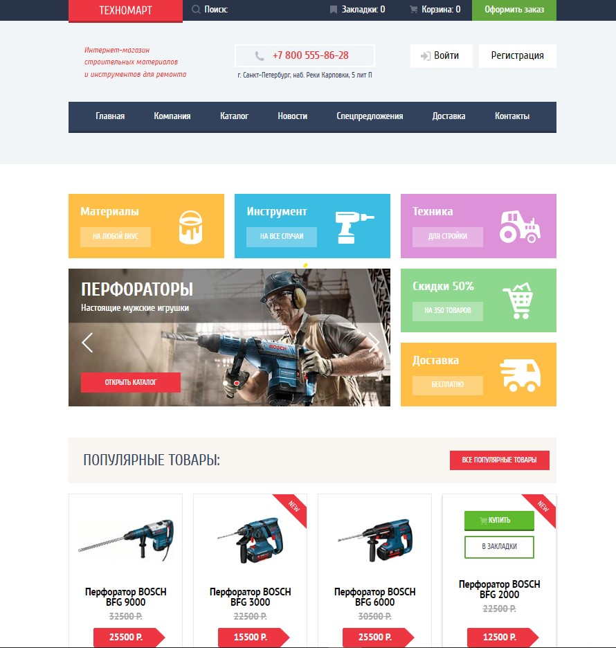
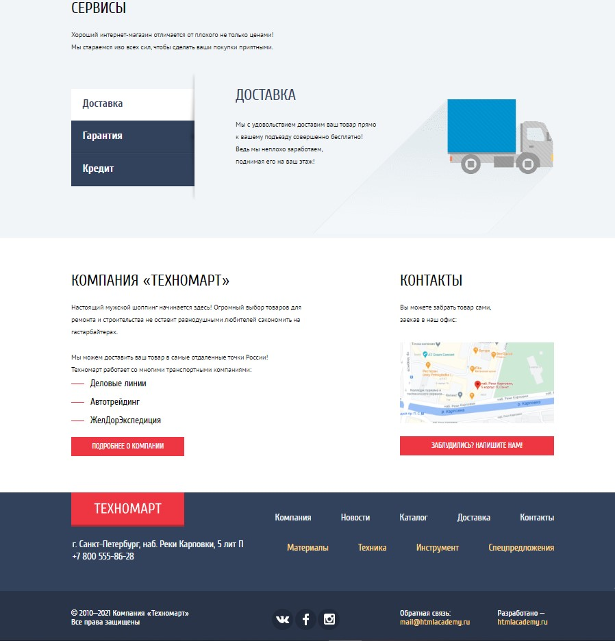
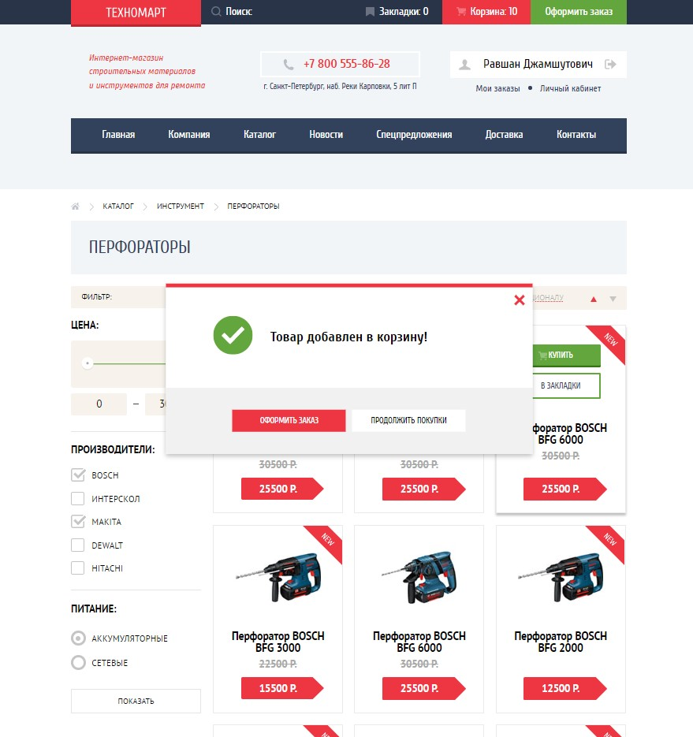
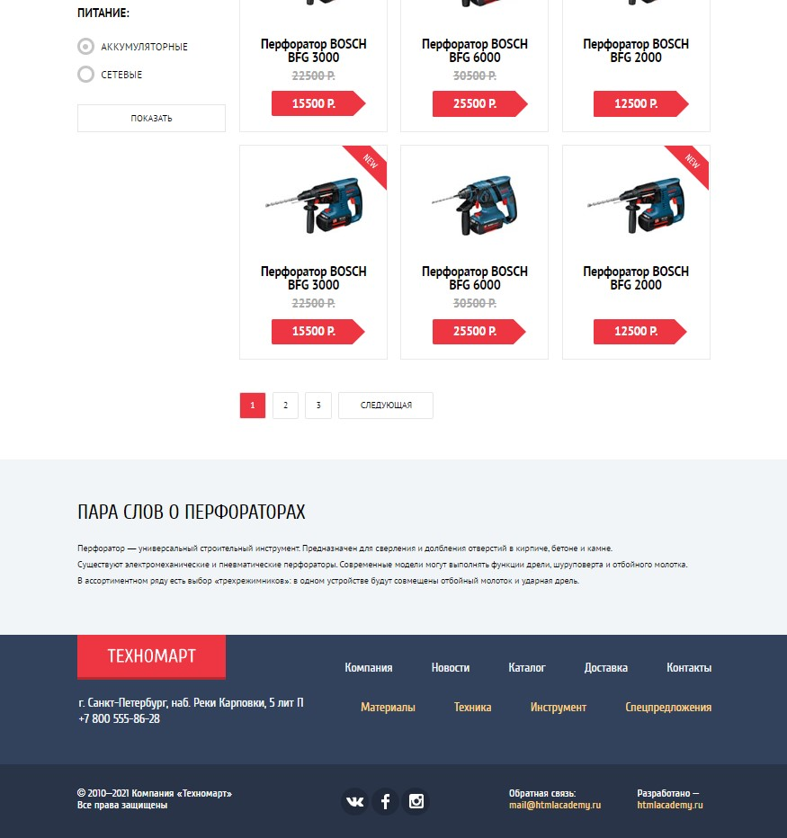

# Верстка для интернет-магазина "Техномарт"

> Личный учебный проект по курсу "Профессиональная вёрстка сайтов" от HTML Academy

## Описание

- Проект:
  - имеет фиксированную верстку
  - выполнен полностью самостоятельно на HTML5 и чистом CSS3
  - проверен на соответствие техническому заданию и критериям академии
  - сверстан по макету Figma
  - имеет оптимизированную графику
  - проходит проверку по Pixel Perfect

## Скриншоты

### Главная страница - верхняя часть

### Главная страница - нижняя часть

### Страница каталога - верхняя часть

### Страница каталога - нижняя часть

